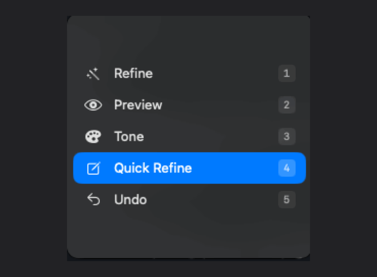
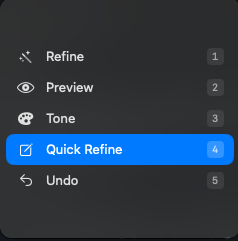
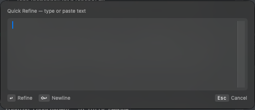

# LingoPulse

**A local, private writing refiner for macOS — one keystroke, any app, including terminals.**

[](https://www.apple.com/macos/)
[](https://swift.org)
[](LICENSE)
[](#tests)

<p align="center">
  
  <br>
  <em>Pick from the menu, type, see the diff. ⌘V anywhere.</em>
</p>

LingoPulse refines your English in any macOS text field using a small language model running locally on your Mac. Right ⌘ to clean up what you've selected. ⇧⇧ → 4 to type a fresh sentence into a scratchpad. The refined output lands on your clipboard for pasting anywhere — including terminals like Claude Code, where Apple Writing Tools, Grammarly, and friends don't reach.

---

## Why LingoPulse?

- **Private by design.** Inference runs on `127.0.0.1` against your local [Ollama](https://ollama.com) instance. No network egress. No telemetry. No API keys to manage.
- **Works in terminals.** Apple Writing Tools and most refinement tools rely on Accessibility text — which terminals don't expose. Quick Refine bypasses that with a typed-input scratchpad.
- **Single keystroke.** Right ⌘ refines the selection (or the whole focused field) in place. Sub-second on Apple Silicon. No popups to dismiss, no menus to hunt.
- **Free.** Open-weight models (Gemma 3, Qwen 2.5). No subscriptions, no rate limits.

---

## Quick start

```bash
# 1. Install Ollama and pull a model
brew install ollama && brew services start ollama
ollama pull gemma3:1b-it-qat        # ~800 MB

# 2. Build LingoPulse
git clone https://github.com/OrShmuel22/lingopulse.git
cd lingopulse/app
swift build --configuration release
./scripts/build-bundle.sh release

# 3. Install and run
cp -R LingoPulse.app /Applications/
open /Applications/LingoPulse.app
```

Grant Accessibility permission when prompted. That's it — no Python, no daemons, no LaunchAgents.

**Requires** macOS 14 (Sonoma) or later, Apple Silicon, and [Ollama](https://ollama.com).

---

## Using it

### Right ⌘ — refine in place

Select text in any AX-aware field (Mail, Notes, Slack, Safari, …). Tap **Right ⌘**. The selection is replaced with the refined version. With nothing selected, the whole field is refined.

### ⇧⇧ — Quick Action menu

Double-tap **⇧** to bring up the menu. Press the digit to pick:

<p align="center">
  
</p>

| Key | Action |
|-----|--------|
| **1 Refine** | Same as Right ⌘. |
| **2 Preview** | Refine, but show a diff first. Apply with Enter; reject with Esc. |
| **3 Tone** | Pick a tone (Casual, Neutral, Professional, Technical, Grammar-only) and refine. |
| **4 Quick Refine** | Open a typed-input scratchpad. See below. |
| **5 Undo** | Roll back the last refinement. |

### Quick Refine — for apps that block Accessibility text

Claude Code's terminal pane, iTerm, Cursor's terminal, web prompts — anywhere AX text isn't exposed.

<p align="center">
  
</p>

1. **⇧⇧ → 4**. Capture panel opens, focused.
2. Type or paste. **Enter** submits; **Shift+Enter** inserts a newline.
3. The diff preview opens; the refined text is already on your clipboard.
4. **Esc** to dismiss, then **⌘V** in your app.

Default tone is Grammar-only (minimum-edit). Press **T** from the preview to re-refine with a different tone.

### Ctrl+G — refine your shell command

For zsh and bash, install the shell widget under Settings → Advanced → Shell integration. Press **Ctrl+G** mid-line — it's replaced with the refined version in place.

### Live Mode (opt-in)

Settings → Advanced → Live Mode. As you type in any AX-aware field, LingoPulse refines after a configurable pause and offers an inline ghost overlay. **Enter** applies, **Esc** dismisses. Disabled in 1Password and terminals by default.

---

## Models

Pick under **Settings → Models & Prompts → Refine model**.

| Tier | Model | Size | Notes |
|------|-------|------|-------|
| Light | `gemma3:1b-it-qat` | ~1 GB | Default. Lowest latency on Apple Silicon. |
| Medium | `gemma4:e2b` | ~7 GB | Better quality, still fast on M-series. |
| Strongest | `gemma4:e4b` | ~10 GB | Highest quality. Slower; warm-up via Keepalive recommended. |

Any chat-tuned model Ollama supports works in principle. Pull with `ollama pull <tag>`.

---

## Privacy

- **No network egress.** All inference is HTTP to `127.0.0.1:11434` (Ollama). No analytics. No crash reports. No telemetry.
- **No keystroke buffer.** Refines run on your trigger. Live Mode reads the focused field's text via Accessibility on demand; nothing is logged off-device.
- **Shell bridge is loopback-only.** When enabled, the local HTTP server binds `127.0.0.1`, requires a generated bearer token (`~/.config/lingopulse/shell-token`, mode 0600), and rejects non-loopback connections.

User data stays under `~/.config/lingopulse/` (settings, audit log) and `~/.cache/lingopulse/` (undo ring).

---

## Honest limits

- Right ⌘ and Live Mode don't fire in apps that don't expose AX text — use Quick Refine (universal) or the `lp-refine` shell widget (zsh/bash) instead.
- Apple Intelligence Writing Tools is **not** used (no Hebrew support as of macOS 26.1, and it doesn't reach terminals either).
- The shell-widget installer writes two lines to your shell rc file. Idempotent, clearly marked, but review the diff if you keep your rc under version control.

---

<details>
<summary><b>Configuration</b></summary>

`~/.config/lingopulse/config.json` is the source of truth. Defaults are sensible — only override what you want to change.

| Path | Purpose |
|------|---------|
| `fixer.model` | Default Ollama model used for refinement |
| `fixer.timeout_seconds` | Per-call timeout (default 15) |
| `keepalive.ollama_keep_alive` | How long Ollama keeps the model warm (default `30m`) |
| `keepalive.active_hours_start/end` | When to issue keep-alive pings |
| `ring_buffer.size` | Undo history depth (default 5) |
| `alerts.suppress_interval_seconds` | Modal-alert dedupe window (default 300) |

Per-user overrides set via Settings (model, prompts, tones) live in `NSUserDefaults` under `lp.*` keys.

</details>

<details>
<summary><b>Architecture</b></summary>

Single Swift menu-bar app. In-process: Ollama HTTP client, prompt builder, ring buffer, history store, AX selection bridge, Live Mode AX observer. No daemon, no Python, no Raycast.

```
app/Sources/LingoPulseApp/
├── Services/      Ollama HTTP, Fixer, AppConfig, Prompts, Protection,
│                  HistoryStore, RingBuffer, AccessibilityService,
│                  SelectionService, ClipboardService, LiveTextMonitor,
│                  KeepaliveOrchestrator, HealthMonitor, ShellBridgeServer,
│                  ShellInstaller, Debouncer, SpellCheck, ToneOverrides,
│                  TriggerMonitor
├── Commands/      PreviewCommand, ToneCommand, QuickRefineCommand, UndoCommand
├── Views/         QuickActionPanel, QuickRefineCapturePanel, PreviewPanel,
│                  TonePickerPanel, UndoFallbackPanel, GhostOverlayWindow,
│                  ModelsPromptsTab
├── AppDelegate, AppCoordinator, MenuBarController
├── SettingsWindow, OnboardingWindow
└── Preferences (UserDefaults bridge)
```

Targets `swift-tools-version: 5.9`, macOS 14+. No external Swift dependencies — only AppKit, SwiftUI, ApplicationServices, ServiceManagement.

</details>

<details>
<summary><b>Tests</b></summary>

```bash
cd app
swift test
```

177 tests across 30+ suites covering: trigger state machine, AX read/write, Ollama client (mocked URL session), prompt building, ring buffer persistence, shell-bridge auth, Live Mode debounce, health monitor, spell-check round-trip, protection/redaction, and Quick Refine command flow.

</details>

<details>
<summary><b>Uninstall</b></summary>

```bash
rm -rf /Applications/LingoPulse.app
rm -rf ~/.config/lingopulse ~/.cache/lingopulse
```

</details>

---

## Contributing

Issues and PRs welcome. Conventional Commits (`feat:`, `fix:`, `refactor:`, `test:`, `docs:`, `chore:`) and `swift test` passing are required for merge.

## License

MIT. See [LICENSE](LICENSE).
